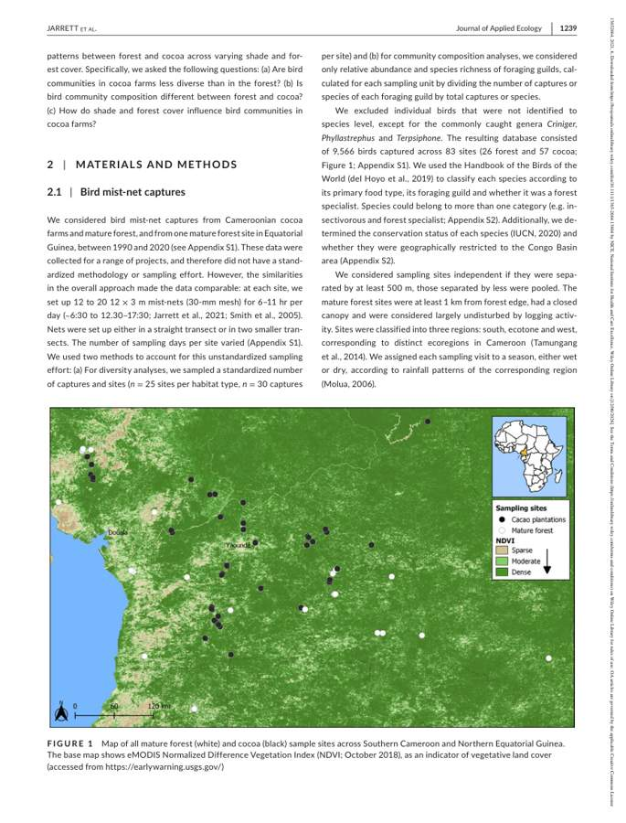
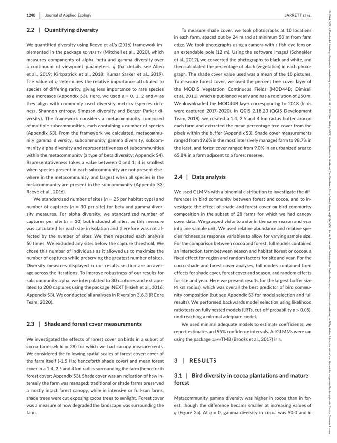
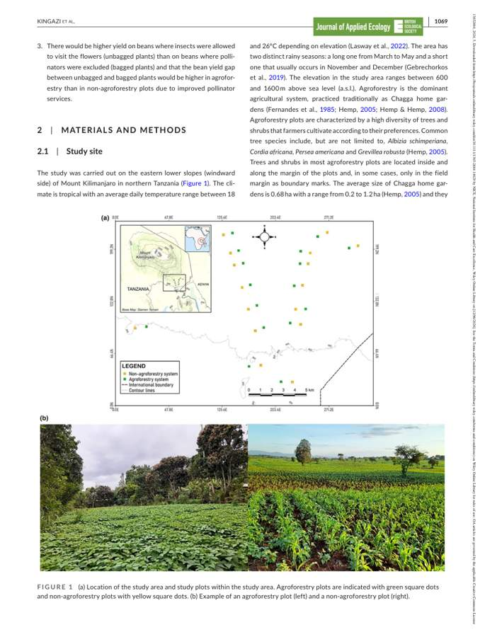
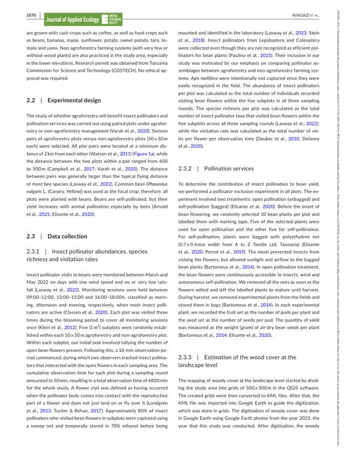

<style>
.hero {
  padding: 1.4rem 1.6rem;
  border-radius: 18px;
  background: linear-gradient(135deg, rgba(0,188,212,.22), rgba(105,240,174,.10));
  border: 1px solid rgba(255,255,255,.14);
  margin-bottom: 1.6rem;
}
.hero h1, .hero h2, .hero h3 { margin-top: 0; }
.grid-cards {
  display: grid;
  grid-template-columns: repeat(auto-fit, minmax(210px, 1fr));
  gap: .85rem;
  margin: 1rem 0 1.4rem 0;
}
.card {
  padding: 1rem;
  border-radius: 14px;
  background: rgba(255,255,255,.055);
  border: 1px solid rgba(255,255,255,.12);
}
.card .big {
  font-size: 1.9rem;
  font-weight: 750;
  line-height: 1;
}
.card .label {
  opacity: .82;
  margin-top: .35rem;
}
.good { color: #69f0ae; font-weight: 700; }
.warn { color: #ffd166; font-weight: 700; }
.bad { color: #ff8a80; font-weight: 700; }
.small { font-size: .92rem; opacity: .9; }
.pdf-frame {
  width: 100%;
  height: 760px;
  border: 1px solid rgba(255,255,255,.18);
  border-radius: 12px;
  background: white;
}
.workflow {
  font-family: ui-monospace, SFMono-Regular, Menlo, Monaco, Consolas, "Liberation Mono", monospace;
  background: rgba(255,255,255,.06);
  border: 1px solid rgba(255,255,255,.12);
  border-radius: 14px;
  padding: 1rem;
  white-space: pre-wrap;
}
</style>

<div class="hero">

## What this page shows

This page documents the current **prototype** pipeline for extracting metadata from ecological papers and preparing PREDICTS PV07 forms. The key aim is **auditability**: each filled field should be traceable to evidence from the paper text, methods, tables, maps, OCR/vision output, or downloaded repository data.

The pipeline is not presented as fully automatic yet. It is an audit-first workflow where difficult fields such as **site counts, species counts, dates, coordinates and study splitting** are flagged for human validation.

</div>

# Current status

<div class="grid-cards">
  <div class="card">
    <div class="big">58</div>
    <div class="label">test PDFs in the working batch</div>
  </div>
  <div class="card">
    <div class="big">2</div>
    <div class="label">worked examples documented here</div>
  </div>
  <div class="card">
    <div class="big">11</div>
    <div class="label">pipeline stages with saved evidence</div>
  </div>
  <div class="card">
    <div class="big">PV07</div>
    <div class="label">filled PDF output target</div>
  </div>
</div>

| Component | Current state |
|---|---|
| PDF text extraction | <span class="good">Working</span> for searchable PDFs using `pdfplumber`. |
| Article tables | <span class="good">Working</span> with Docling table export, but still needs table relevance filtering. |
| OCR / page images | <span class="good">Working</span> as supporting evidence for maps, figures and scanned tables. |
| Vision model | <span class="warn">Optional</span>; useful for audit evidence, not trusted as sole source. |
| Repository downloads | <span class="warn">Improving</span>; Dryad DOI and Dryad share-link cases now documented as key failure modes. |
| PV07 form filling | <span class="good">Working</span> once metadata fields are extracted. |
| Metadata correctness | <span class="warn">Requires validation</span>, especially for sites, species, coordinates, dates and multi-study papers. |

# Why this pipeline is needed

PREDICTS metadata extraction is difficult because ecological papers rarely report all PV07 fields in one clean table. Important information may be split across:

- title page and abstract;
- Materials and Methods;
- study-site maps and figure captions;
- result tables;
- supplementary tables;
- repository ZIP files;
- data availability statements;
- README files inside downloaded archives.

A robust workflow therefore needs to combine deterministic extraction rules, repository download logic, table parsing, OCR/vision evidence, and cautious LLM fallback. The LLM is used only for missing or weak fields and should not overwrite stronger deterministic evidence.

# Pipeline at a glance

<div class="workflow">
PDF paper
   ↓
1. Extract text and DOI/citation metadata
   ↓
2. Extract Docling tables from the article PDF
   ↓
3. Discover supplementary/data links and repository DOIs
   ↓
4. Download files and recursively unzip archives
   ↓
5. Parse CSV/XLSX/TXT/JSON/PDF supplementary evidence
   ↓
6. Export useful pages as images
   ↓
7. OCR and optional vision analysis for maps/figures/scanned tables
   ↓
8. Deterministic metadata extraction
   ↓
9. Optional LLM fallback for missing/weak fields only
   ↓
10. Save master JSON + evidence workbook
   ↓
11. Fill the PREDICTS PV07 PDF form
</div>

# Evidence sources

| Evidence source | Why it is used | Example PV07 fields |
|---|---|---|
| Main PDF text | Highest-value source for study design, Methods, dates and descriptions. | Title, abstract, country, study description, sampling method, dates. |
| Article tables | Captures structured information embedded in the PDF. | Site tables, species tables, sampling units, model/table evidence. |
| Repository downloads | Often contains the actual sampling data. | Site IDs, species columns, coordinates, years, abundance units. |
| ZIP extraction | Many datasets are nested inside repository ZIP files. | CSV/XLSX files inside archives. |
| OCR | Recovers text from maps, image-only pages and scanned figure panels. | Coordinates, site labels, captions. |
| Vision model | Optional audit support for maps and complex visual tables. | Approximate map interpretation and visual evidence summaries. |
| LLM fallback | Only fills gaps after deterministic extraction. | Ambiguous text fields and comments, subject to validation. |

# Output produced per paper

Each paper receives a paper-specific output directory. The important outputs are:

| Output | Purpose |
|---|---|
| `text_metadata.json` | Page-aware PDF text and text-derived metadata. |
| `doi_metadata.json` | DOI and citation extraction. |
| `pdf_tables/` | Docling tables as CSV/XLSX/HTML. |
| `supplementary_files/` | Downloaded repository or publisher supplementary files. |
| `extracted_data/` | Parsed and sampled downloaded tables, including unzipped files. |
| `pdf_images/` | Page images selected for OCR/vision. |
| `image_extracted_data/` | OCR text, vision JSON and map/coordinate evidence. |
| `evidence_used_for_form.xlsx` | Human-readable evidence workbook. |
| `master_metadata.json` | Final metadata object used to fill PV07. |
| `*_filled_predicts.pdf` | Filled PV07 form. |

# Repository download logic

The repository downloader is deliberately redundant because ecological papers and publishers use inconsistent formats. URLs and DOIs are often broken across lines in PDFs, and repository landing pages do not always directly expose the data file.

| Source | Current handling |
|---|---|
| Dryad DOI datasets | Detect `10.5061/dryad.*`, open Dryad landing/API pages and resolve file-stream/download links. |
| Dryad share links | Detect `datadryad.org/stash/share/...` links and scrape the share landing page for downloadable files. |
| Figshare | Use Figshare article/file API when an article ID or DOI is found. |
| Zenodo | Use records/files API where possible. |
| EIDC/CEH | Resolve UUID-style `10.5285/*` package links. |
| OSF | Scrape storage/download URLs. |
| Publisher supplementary material | Scrape article HTML for supplement/mediaobject/download anchors. |
| Nested ZIP files | Recursively unzip and parse CSV/XLSX files inside archives. |

::: {.callout-warning}
## Important limitation

A downloaded file is not automatically the correct evidence for every field. For example, a repository may contain historical records, trait tables, model summaries, or treatment-level data. Site/species counts must be interpreted against the paper Methods.
:::

# Example 1: Jarrett et al. 2021

## Why this example matters

Jarrett is useful because it tests a common PREDICTS problem: the repository data contains large CSV files with several possible counting units. The pipeline must not blindly use the largest unique count if the paper defines the study design differently.

## Paper metadata

| Field | Value |
|---|---|
| First author | Jarrett |
| Year | 2021 |
| Title | Bird communities in African cocoa agroforestry are diverse but lack specialized insectivores |
| Journal | Journal of Applied Ecology |
| DOI | `10.1111/1365-2664.13864` |

## Current extracted PV07-style metadata

| Field | Current value |
|---|---|
| Countries | Cameroon; Equatorial Guinea |
| Region | Southern Cameroon; Northern Equatorial Guinea |
| Sampling method | Mist-netting |
| Article-reported sites | 83 |
| Study date range | 1990–2020 |
| Abundance metric | abundance |
| Abundance unit | individuals |
| Sampling effort unit | net |

## Downloaded data evidence

| File | Rows | Evidence extracted |
|---|---:|---|
| `CaptureDataset.csv` | 22,368 | Species, year, season, site, country, region and habitat columns. |
| `CocoaFarmTreeCover.csv` | 38 | Farm IDs and latitude/longitude columns. |
| `BirdCharacteristics.csv` | 259 | Species traits and feeding guild information. |

## Audit notes

| Issue | Why it matters | Current interpretation |
|---|---|---|
| Site counts differ between article text and supplementary tables. | Different files encode different sampling units. | Prefer the article Methods count when it defines the design; keep repository counts as audit evidence. |
| Species counts differ between capture records and trait tables. | Trait tables may not equal sampled abundance records. | Keep a conflict flag and avoid silent overwrite. |
| Countries may need explicit listing. | PV07 may need country names or separate studies depending on final curation. | Store Cameroon and Equatorial Guinea clearly in comments/evidence. |

## Visual evidence

{fig-alt="Exported page image from Jarrett et al. used as audit evidence."}

{fig-alt="Exported page image from Jarrett et al. used as OCR or visual evidence."}

# Example 2: Kingazi et al. 2024

## Why this example matters

Kingazi is useful because it exposed two important failure modes:

1. the data availability link goes to a Dryad landing page containing a ZIP file;
2. the site count can be misread if the extractor confuses treatment types, plot IDs and paired design.

The corrected interpretation is that the paper reports **16 paired sampling blocks/sites**, with 16 agroforestry plots paired with 16 non-agroforestry plots. The repository data also contains 32 plot IDs because each pair has two plot types.

## Paper metadata

| Field | Value |
|---|---|
| First author | Kingazi |
| Year | 2024 |
| Title | Tropical agroforestry supports insect pollinators and improves bean yield |
| Journal | Journal of Applied Ecology |
| DOI | `10.1111/1365-2664.14629` |
| Repository | Dryad dataset DOI `10.5061/dryad.3tx95x6pd` |

## Current extracted PV07-style metadata

| Field | Current value |
|---|---|
| Country | Tanzania |
| Continent/region | Africa |
| Location | Eastern lower slopes of Mount Kilimanjaro; Kilimanjaro Region; Northern Tanzania; Chagga home gardens |
| Sampling method | Fixed plots/quadrats |
| Number of sites | 16 paired blocks/sites |
| Plot records in repository | 32 plot IDs |
| Number of species/taxa | 45 |
| Study dates | March–May 2022 |
| Abundance metric | abundance |
| Abundance unit | individuals |
| Sampling effort unit | plot |

## Downloaded data evidence

| File | Rows | Evidence extracted |
|---|---:|---|
| `Bean yield data.csv` | 120 | Yield records by plot, pair, habitat type and pollination treatment. |
| `Insect pollinator data.csv` | 32 | Pollinator abundance/richness/visitation rate by plot and pair. |
| `NMDS_Data.csv` | 32 | Taxon-by-plot matrix with plot IDs and habitat type. |

## Dryad archive structure

```text
supplementary_files/
└── 10.5061_dryad.3tx95x6pd_dataset.zip

extracted_data/
├── 10.5061_dryad.3tx95x6pd_dataset_unzipped/
│   ├── Data_Kingazi_et_al..zip
│   └── README.csv
└── Data_Kingazi_et_al._unzipped/
    └── Data/
        ├── Bean yield data.csv
        ├── Insect pollinator data.csv
        └── NMDS_Data.csv
```

## Visual evidence

Page 3 contains the study map and example agroforestry/non-agroforestry plots.

{fig-alt="Kingazi et al. page 3 with study map and example agroforestry/non-agroforestry plots."}

Page 4 contains the experimental design and sampling details.

{fig-alt="Kingazi et al. page 4 with experimental design and pollinator sampling methods."}

## Quality-control interpretation

| Field | Risk | Correct handling |
|---|---|---|
| Number of sites | The extractor may confuse one broad study area, two treatments, 16 pairs, or 32 plot IDs. | Use **16 paired blocks/sites** for PV07 site count, and record 32 plot IDs as supporting repository evidence. |
| Sampling design | Two treatment types are not two sites. | Treat agroforestry and non-agroforestry as paired plot types within the design. |
| Repository download | A shallow downloader may stop at the Dryad page and miss the ZIP. | Resolve the Dryad DOI to the ZIP and recursively extract CSVs. |

# Filled PV07 form example

The embedded PDF below is the filled PV07 form for the Kingazi example.

[Open the filled Kingazi PV07 PDF](examples/JM1_2024__Kingazi/JM1_2024__Kingazi_filled_predicts.pdf)

<iframe 
  class="pdf-frame"
  src="examples/JM1_2024__Kingazi/JM1_2024__Kingazi_filled_predicts.pdf">
</iframe>

# Cross-example comparison

| Feature | Jarrett et al. 2021 | Kingazi et al. 2024 |
|---|---|---|
| Taxon/group | Birds | Insect pollinators and bean yield |
| Study system | Cocoa agroforestry | Chagga home gardens / bean plots |
| Countries | Cameroon; Equatorial Guinea | Tanzania |
| Repository challenge | Multiple large CSV files with different sampling units. | Dryad DOI points to a ZIP containing nested data files. |
| Strongest evidence for dates | Repository year column and article text. | Methods and data files: March–May 2022. |
| Strongest evidence for sites | Article Methods: 83 sites. | Article Methods: 16 paired blocks/sites; repository has 32 plot IDs. |
| Main QC risk | Conflicting species/site counts across files. | Treatment/plot count mistaken for site count. |

# Validation rules before filling PV07

| Rule | Rationale |
|---|---|
| Prefer explicit Methods design counts over generic counts found in result tables. | Model tables often contain treatment levels, not sites. |
| Keep repository-derived counts as evidence, not automatic truth. | Repository files may encode visits, farms, records, traits or historical datasets. |
| Prefer downloaded coordinates over map OCR when coordinate columns exist. | Repository coordinates are usually more precise and machine-readable. |
| Never silently overwrite a field when PDF text, tables and repository data disagree. | Conflicts should be visible in the evidence workbook. |
| Recursively unzip archives and parse nested files. | Many repositories package data in nested folders or ZIPs. |
| Treat LLM output as fallback only. | Prevents hallucinated fields and invalid PV07 dropdown entries. |
| Save both final value and evidence source. | Makes the filled PDF auditable. |

# Known issues and fixes in progress

| Issue | Status |
|---|---|
| Some papers still fail repository download because they use non-standard share links. | Being patched with repository-specific handlers. |
| Excel audit output can fail when OCR text contains illegal characters. | Patched by stripping characters that `openpyxl` cannot write. |
| Site counts remain the highest-risk field. | Needs a conflict log and `site_count_source` field. |
| Species counts can be overwritten by weak evidence. | Needs stricter priority rules and species-count provenance. |
| Some visual/OCR evidence is noisy. | Keep it as supporting evidence, not as primary evidence when text/repository data are stronger. |

# Recommended next steps

1. Add `qc_flags` to `master_metadata.json`.
2. Add `site_count_source`, `species_count_source`, `date_source` and `coordinate_source`.
3. Produce a one-page HTML audit summary per paper.
4. Add regression tests for known examples: Kingazi, Jarrett, Klinkovská, Guenat, Geldenhuys and Betemariyam.
5. Add unit tests for Dryad DOI, Dryad share-link, Figshare, Zenodo, EIDC and OSF download functions.
6. Decide with the PREDICTS team how paired designs should be represented consistently in PV07.

# Minimal command-line example

::: {.callout-note collapse="true"}
## Batch command used for the test set

```bash
find ../Papers2Test -iname "*.pdf" | while read paper; do
  python predicts_form.py \
    --paper "$paper" \
    --form PREDICTS_Form_v07.pdf \
    --compiler-first Joana \
    --compiler-last Medeiros \
    --compiler-id JM1 \
    --compiler-email j.medeiros@pgr.reading.ac.uk \
    --download-dir ./downloaded_data \
    --model gemma3:4b \
    --vision-model moondream \
    --vision-max-pages 15 \
    --max-ocr-pages 15
done
```
:::